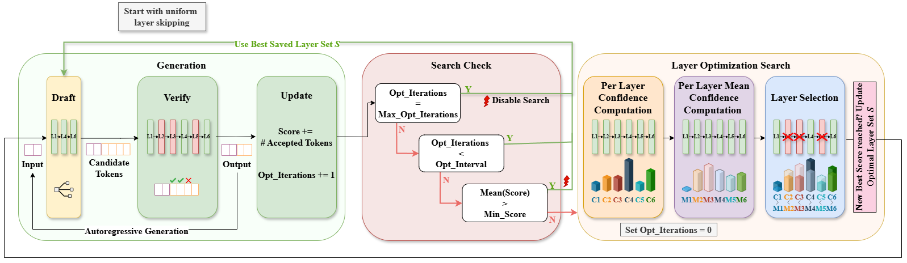

<div align="center"><h1>&nbsp;ConfLayers</h1></div>

<p align="center">
<a href="https://arxiv.org/abs/2604.14612">
  </a> 
<a href="https://opensource.org/licenses/Apache-2.0">
  </a> 

# ConfLayers: Adaptive Confidence-based Layer Skipping for Self-Speculative Decoding

## Introduction

We introduce ConfLayers, a confidence-driven and training-free framework for constructing adaptive draft subnetworks in self-speculative decoding. ConfLayers estimates intermediate-layer confidence during generation to assess each layer’s contribution to predictive certainty, selectively skipping layers with low confidence impact. The draft configuration is iteratively refined based on verifier acceptance, producing a compact and context-aware subnetwork without retraining or architectural modification. Across diverse benchmarks and multiple models, ConfLayers achieves up to 1.4× speedup over standard autoregressive decoding while maintaining high output quality. It consistently outperforms prior heuristic and dynamic skipping or early-exiting baselines such as SWIFT and DEL, demonstrating robust and efficient acceleration.



## Installation

```
conda env create -f environment.yml
conda activate conflayers
pip3 install torch torchvision --index-url https://download.pytorch.org/whl/rocm6.4
```

## Inference

Run command lines in `eval_llama.sh`, the results will be stored in `outputs/.../model_answer/`.

```
chmod +x eval.sh
hf auth login
./eval.sh
```

> For quick start with cached layer configuration in skip_layers.json, uncomment `--cache-hit` in `eval.sh`.
>

## Acknowledgments

This codebase is built on [Swift](https://github.com/hemingkx/SWIFT.git).

## Citation

If you find the resources in this repository useful, please cite our paper:

```
@misc{amer2026conflayersadaptiveconfidencebasedlayer,
      title={ConfLayers: Adaptive Confidence-based Layer Skipping for Self-Speculative Decoding}, 
      author={Walaa Amer and Uday das and Fadi Kurdahi},
      year={2026},
      eprint={2604.14612},
      archivePrefix={arXiv},
      primaryClass={cs.LG},
      url={https://arxiv.org/abs/2604.14612}, 
}
```
